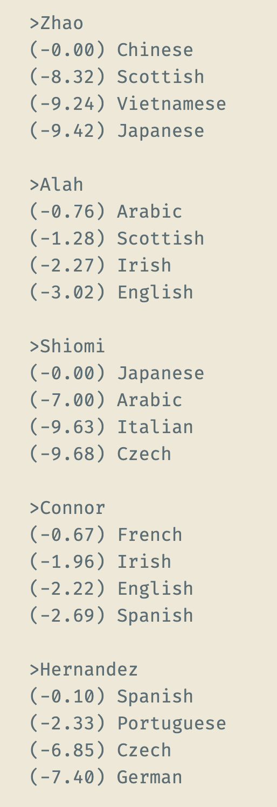
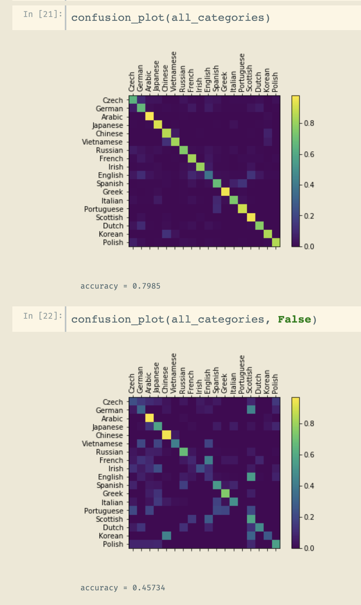
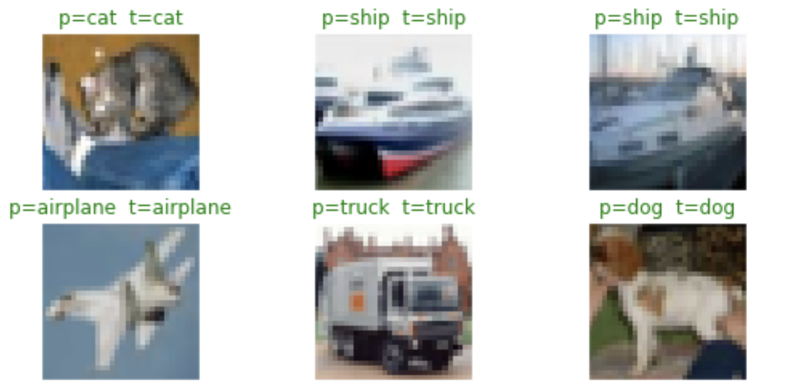
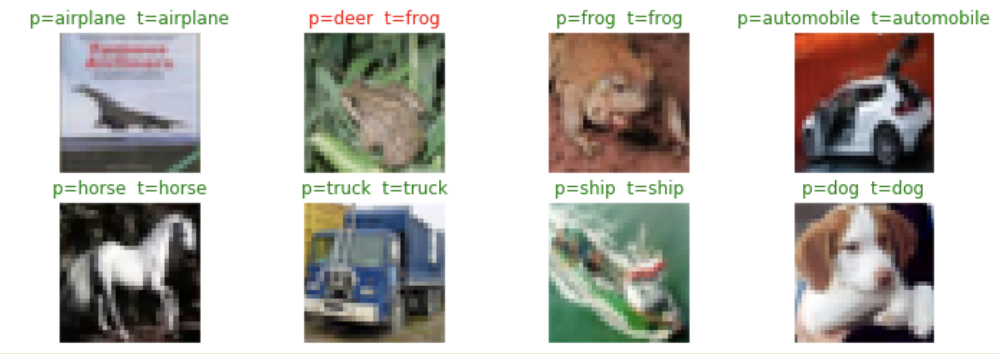
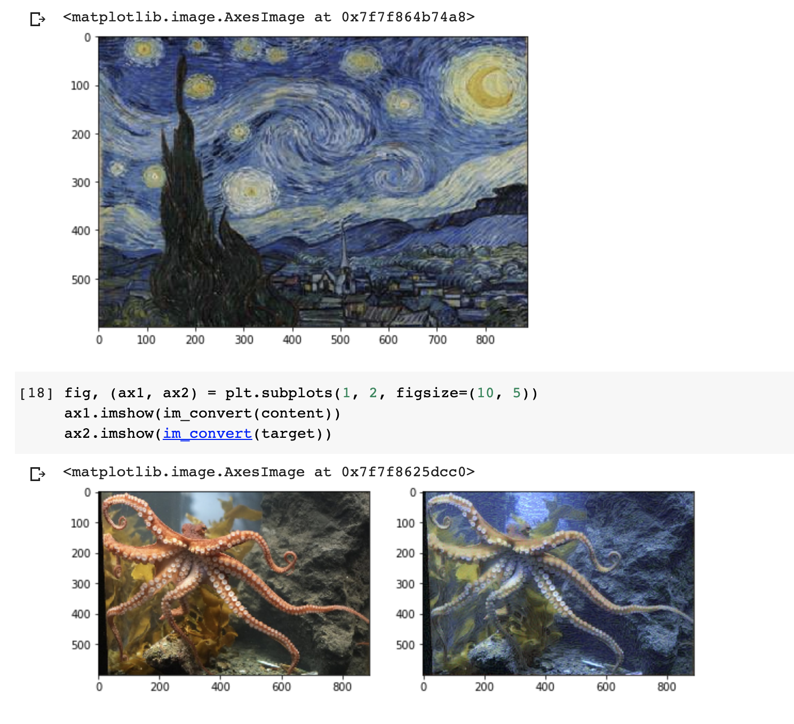
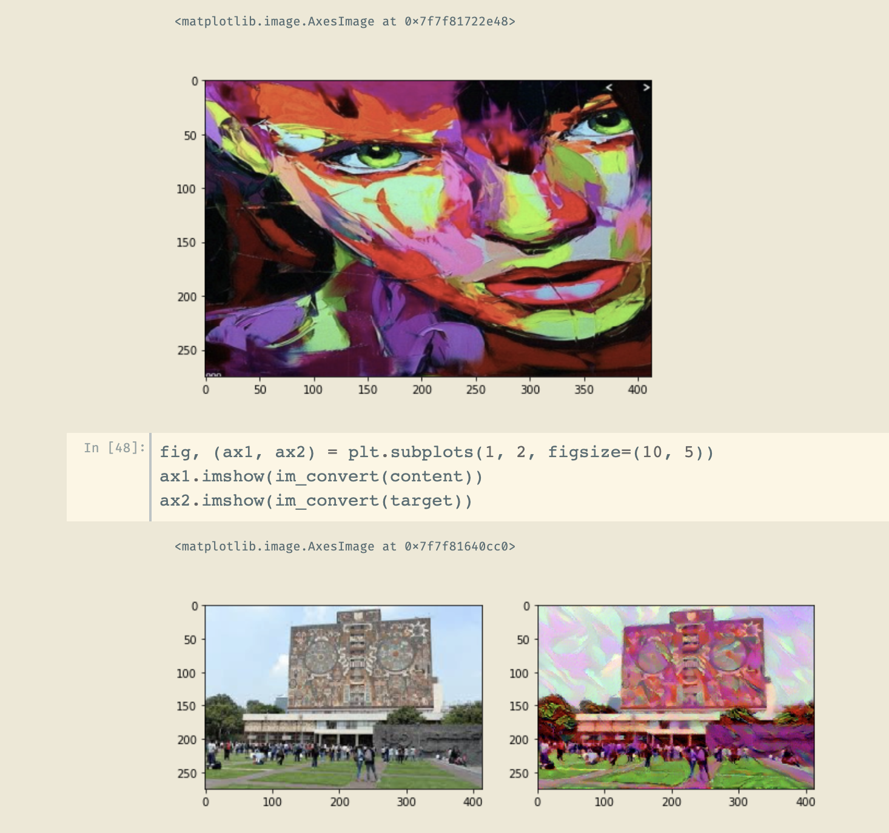
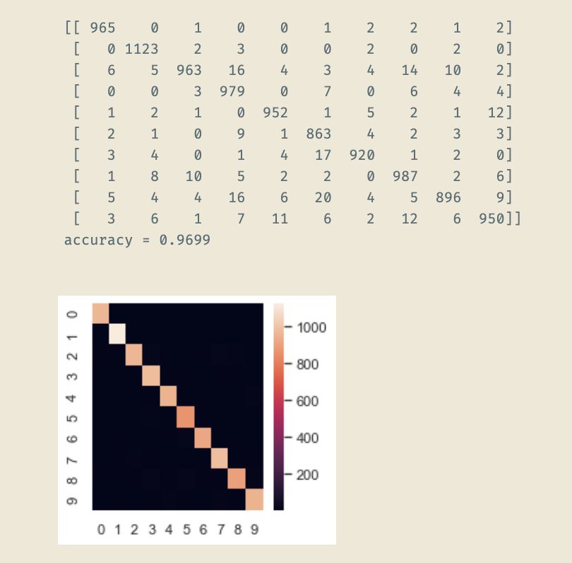
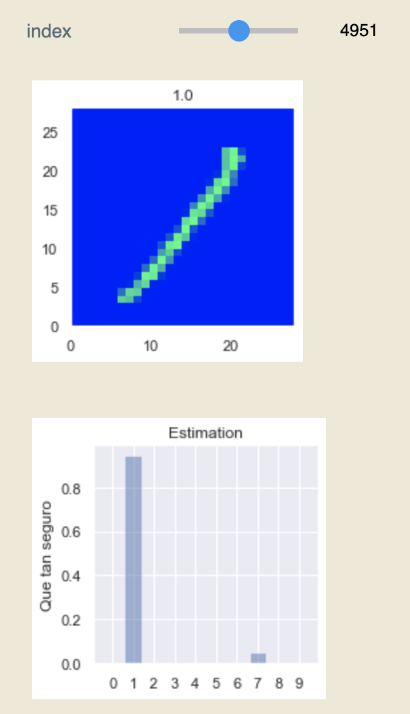
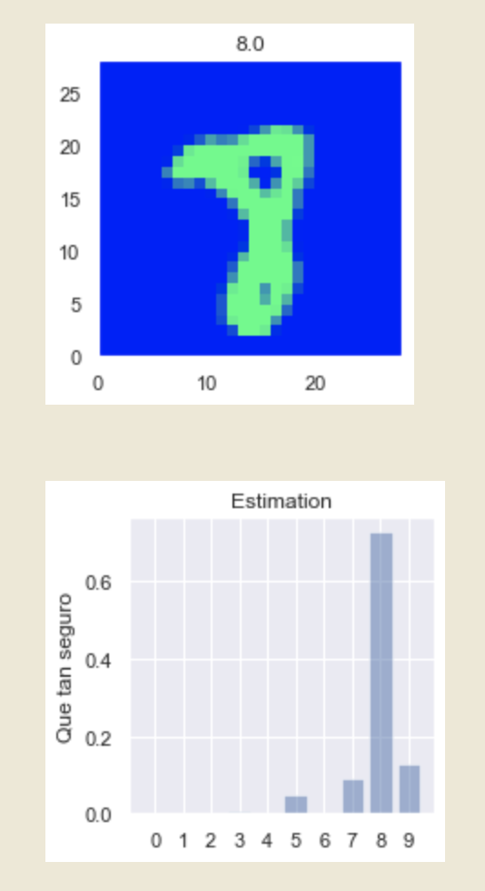
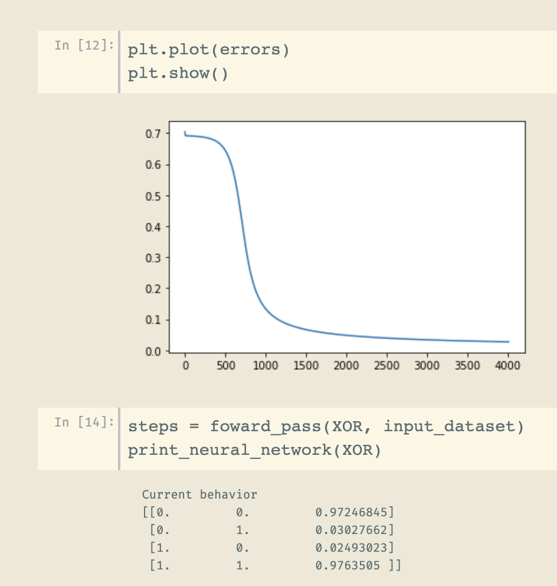

# LearningNeuralNetworks

Code for my experiments learning deep learning and neuronal networks

Here is a showcase of all most important projects, click the images to show the code:

## Surnames origins

A RRN using PyTorch (+ a DIY LSTM module) that can predict the origin of a surname:

[Show me the code](https://soyoscarrh.github.io/LearningNeuralNetworks/Basics_with_Pytorch/Surname/RRN%20Nombres%20LSTM%20DIY.html)

## CIFAR10

A RRN using PyTorch (using convolutional layers) that classifies images suing the CIFAR10
dataset.

[Show me the code](https://soyoscarrh.github.io/LearningNeuralNetworks/Basics_with_Pytorch/CIFRA10/CifraCool.html)

## Style transfer

A neural network that can transfer style to an image, this uses convolutional neuronal networks
and is an Udacity's PyTorch exercise.

[Show me the code](https://soyoscarrh.github.io/LearningNeuralNetworks/Basics_with_Pytorch/StyleTransfer/Style.html)

## MNIST using a MLP

This is a classic example in deep learning, this is a net that recognize digits:

[Show me the code](https://soyoscarrh.github.io/LearningNeuralNetworks/Basics_with_Pytorch/MNIST-Pytorch/MNIST_PytorchBatchNormalization.html)

 
## XOR
This is a classic exercise, is a simple net that can predict the XOR gate:

[Show me the code](https://soyoscarrh.github.io/LearningNeuralNetworks/Basics_with_Pytorch/XOR/My_Neural_Network_XOR.html)

